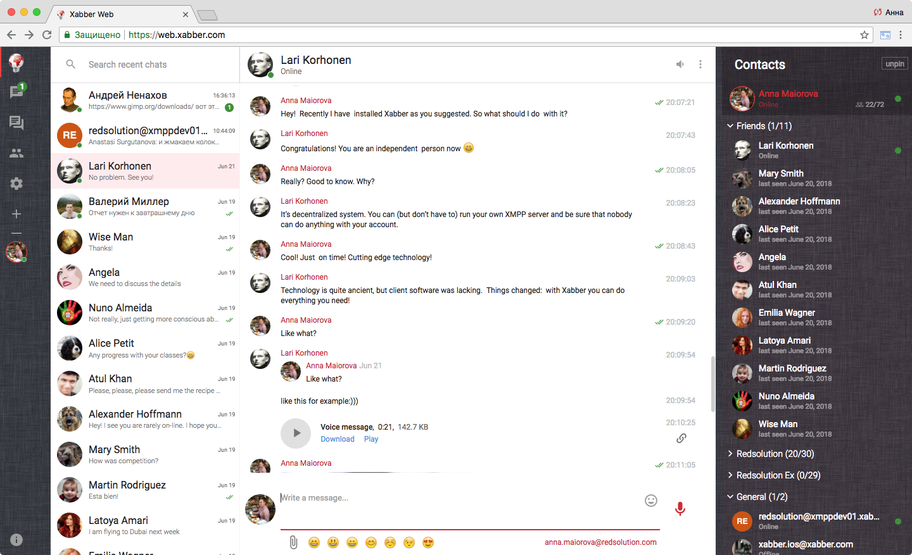
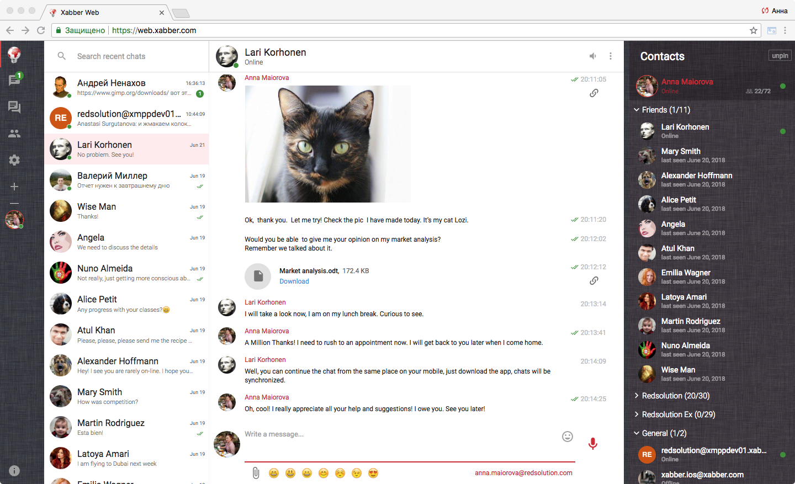

# Xabber for Web

Xabber for Web is an open-source XMPP client built to provide first-class chat experience in any modern browser. It looks and works great and is meant to provide seamless convergence with other versions of Xabber for different platforms.
 

# Features
## Superb design
With clean and elegant interface, Xabber looks and works great. No other existing client can match it, Xabber user experience is second to none.
## Conversations up front
We studied many existing chat solutions, took the best from all of them, then came with some tricks of our own. Xabber is friendly, informative, yet subtle and concise.
## Multiple accounts
Just like Android version, Xabber for Web supports multiple accounts.
## Synchronized settings
Setting up a new device can be tedious. Not anymore. You can log into Xabber with one click, we'll sync your settings from the server and you'll be set in no time.
All your accounts and settings are synchronized instantly, you just need to enter passwords. We don't sync passwords because of safety reasons.
## Sending media
Send and receive audio,  images, voice messages and files, view and forward them! 
 
# Supported XEPs
* XEP-0030: Service Discovery
* XEP-0054: vcard-temp
* XEP-0059: Result Set Management
* XEP-0085: Chat State Notifications
* XEP-0153: vCard-Based Avatars
* XEP-0184: Message Delivery Receipts
* XEP-0313: Message Archive Management
* XEP-0363: HTTP File Upload
* RFC-3920: Core
* RFC-3921: Instant Messaging and Presence

# License 
Xabber is licensed under GNU/GPL v.3 license in 2013. 

## Support Xabber Development
The best among existing clients, Xabber is still far from being outstanding.  Still, there are things that are needed to make Xabber perfectly working, independent and secure client. But perfection is a very expensive thing which we hardly can afford in the present economic situation in Russia and in our small but proud company. 

Our goal is to create a beautiful unified user experience in federated XMPP environment on different platforms. Android version was released in 2011 and made its way to be number one XMPP client for Android.  And we are not about to stop! Improvements keep on coming constantly. iOS version is under development too. 

If like us, you share our goal and feel like being part of this project,  you have many options to help us make it happen.
## Support our Patreon campaign
We launched a crowdfunding campaign on Patreon where we shared our goals, needs, and promises. Take a look!
https://www.patreon.com/xabber/overview

## Donate directly to our PayPal account
It’s the least preferable way for us, but if it’s the most for you - we are happy to bear some inconvenience for your comfort!

## Donate directly to our Bitcoin account
We share with Bitcoin similar values and approaches, so no wonder that we love it!

bitcoin:1L78Z8etFrddc32CrrY88SpsL5mft51JS6

## Join Xabber development
We also welcome any developers, designers, translators, and testers to help us to make the art software together.  Your pull requests will be highly appreciated. 

## Online documentation
[Wiki](https://github.com/redsolution/xabber-web/wiki)

